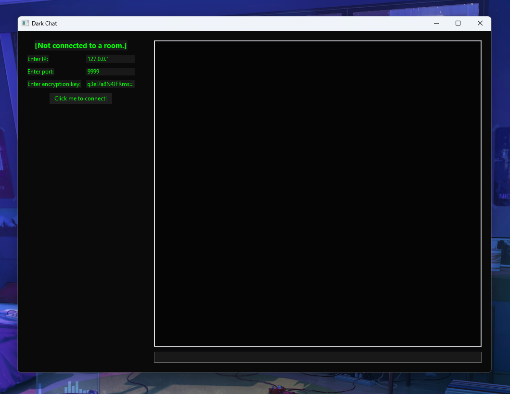
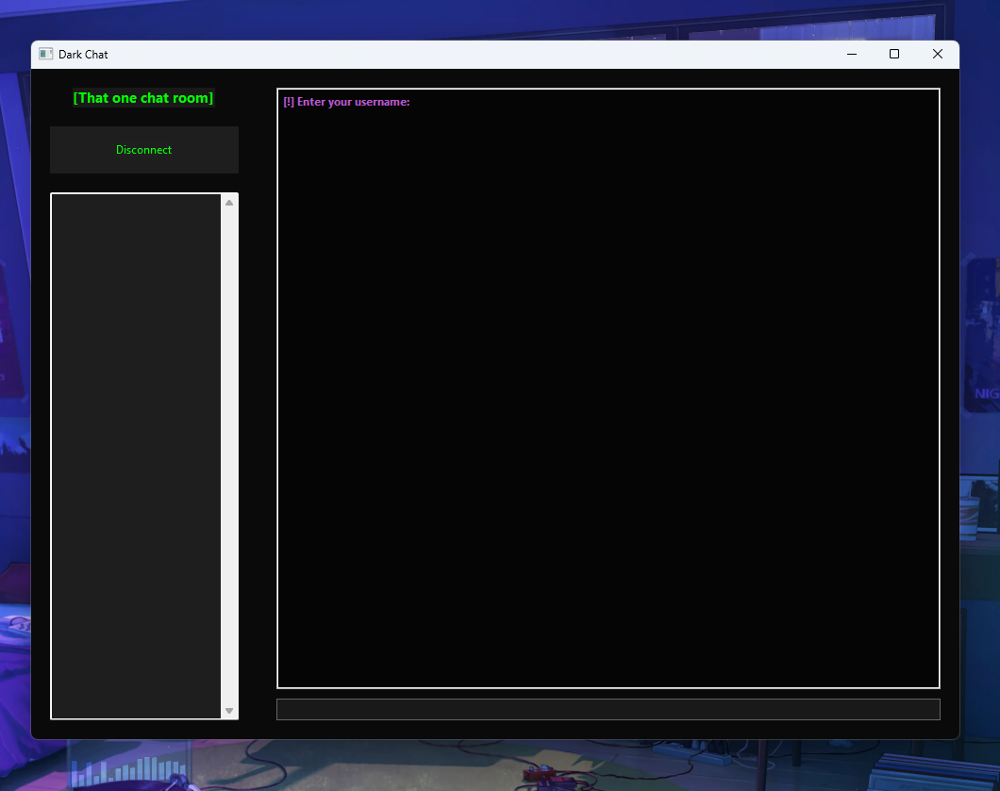
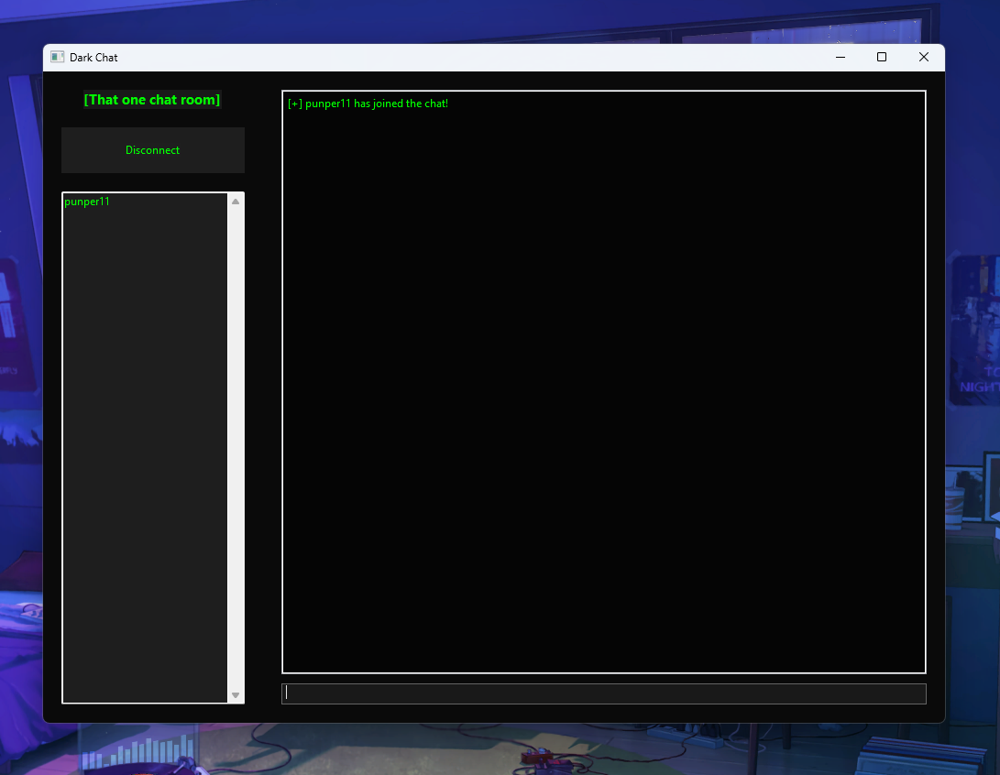
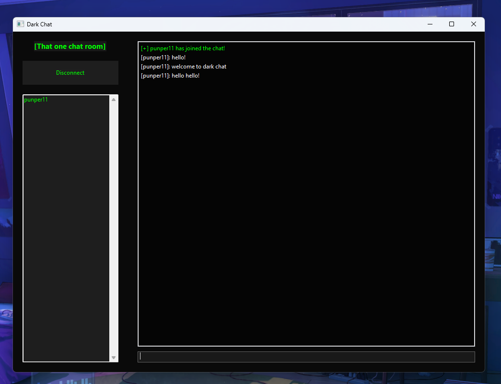
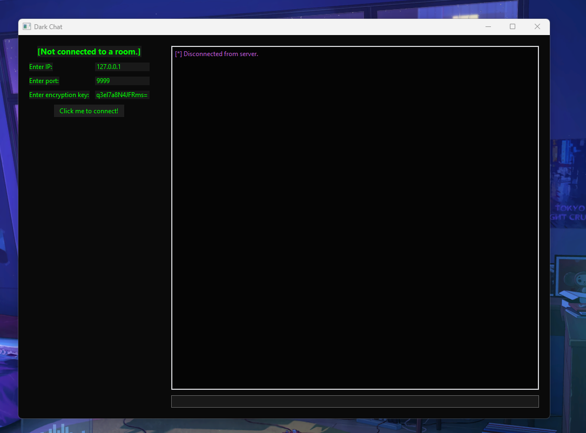

# DarkChat
#### (Secure, Encrypted, Confidental Chatting)
**DarkChat** is a secure, real-time chat application written entirely in Python. It features end-to-end encrypted messaging, a simple, easy to use, and customizable UI using wxPython, and chat rooms that can be hosted by anyone, that support multiple users over a TCP socket server. Users connect to these servers by providing an **IP adress**, a **port**, and an **encryption key**. Once connected, you will be prompted to enter a username. When you do, you will connect. Once you connect, you will be able to chat! Absolutely nothing is logged, so feel free to use this application however you want to 😉 .  

## Connection UI with details entered

## Connected to "That one chat room"

## Entered the username "punper11"

## "punper11" sent a few messages

## Disconnect button was pressed

## Features

- 💬 Real-time encrypted chat (using Fernet encryption)
- 🧪 Custom lightweight socket server
- 🎨 Simple wxPython GUI for chat interface
- 📋 A user list that displays when connected to a server
- 🔐 End-to-end message encryption
- 🧍 Join and disconnect notifications
- 🎧 Sound effects for activity
- ⚙️ Customizable UI/SFX

### Prerequisites

- Python 3.9+

### Running the Client

A **start.bat** script is included in the Dark Chat folder. It should run and install all dependencies as long as you have a version of python above 3.9 on your computer.

### Running the Server

Same as the client, A **start.bat** script is included in the Dark Chat Server folder. It should run and install all dependencies as long as you have a version of python above 3.9 on your computer.

### Security and Confidentiality
Messages are encrypted using Fernet symmetric encryption. This will ensure confedentiality and keep your chat rooms private. To generate an encryption key, use the **key.bat** script. Keep your key secret, and only give it to people you trust. Also, Dark Chat does not log any actions whatsoever. Once you disconnect, all previous messages disapear. 
